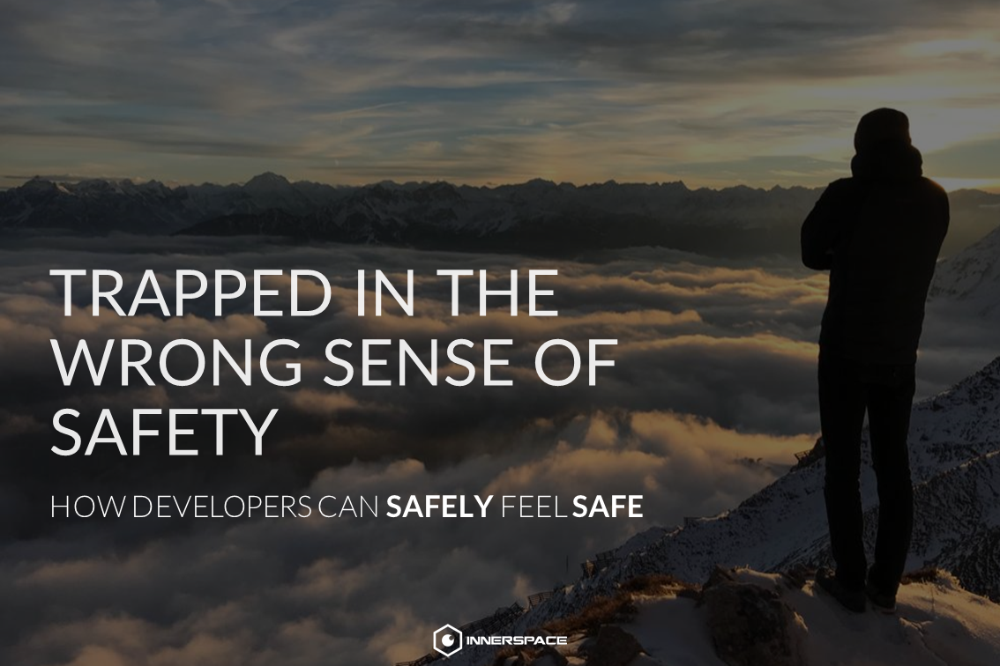

<h1 align="center">Die Falle des falschen Sicherheitsgefühls</h1>

  Wie sich Entwickler <strong>sicher sicher</strong> fühlen.

> Unterlagen zu meinem Vortrag wie sich Softwareentwickler durch Mindset und Technologie sicherer fühlen können. 

## Examples
All the examples can be found under `./examples`.

## Slides
TODO

## Presentations
- *13.12.2018:* Quality Management // SE Master // FH Hagenberg [:file_folder:](https://github.com/bemayr/talk.developer-confidence/releases/tag/2018-12-13-hagenberg)
